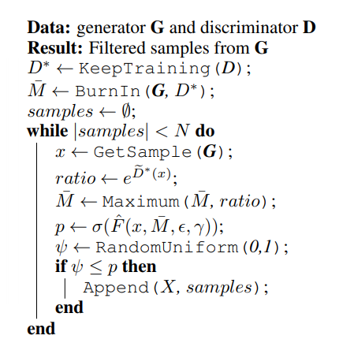
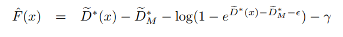

# Discriminator Rejection Sampling Tensorflow

Tensorflow implementation of [Discriminator Rejection Sampling](https://arxiv.org/pdf/1810.06758.pdf)
SAGAN is used as a base model.

## Discriminator Rejection Sampling
 
 

SAGAN with hinge loss is used as a base model. The network is first trained for 10 epochs, and as it's descriped in the paper, the model is further trained using a smaller learning rate. The model uses hinge loss and a sigmoid output is requried to perform DRS. Therefore fc layers are added on top of the discriminator and are further trained using a cross entropy loss.

The rejection sampling algorithm is implemented in the sample.py file.
Once finished training, about 50k samples are generated to estimate M (BurnIn phase).
After estimating M, new samples are generated and their F_hat values are calculated.
For CelebA dataset, 80th percentile value is used for gamma (80th percentile value of F is used as gamma). 

## Requirements

## Results

